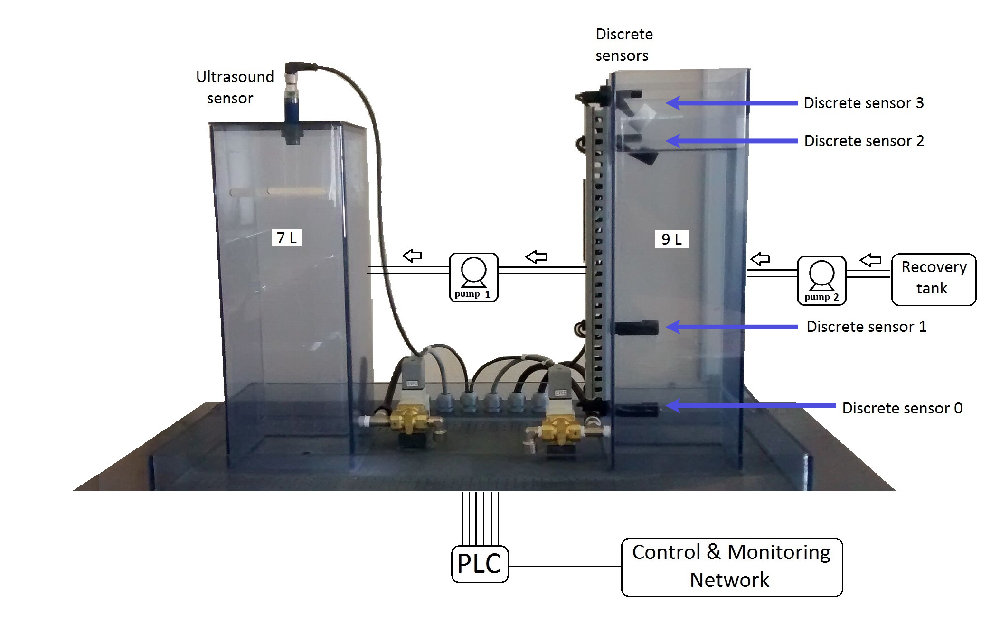

# ML model for anomaly detection

This repo contains my work for the ML course on 'Dataset of anomalies and malicious acts in a cyber-physical subsystem'

You can find the original dataset under `assignment_material` together with the reformatted logs at `exported_logs` and graphs of the
provided data under `exported_graphs_assingment` and  normalized plots under `exported_graphs`.

3 Models have been evaluated, described in `ml_utils.py` looping over different data perparation and training parameters. Using LSTM and Conv
layers.

Data preparation has been done using pandas and numpy and all the model description and training using keras and tensorflow. I have
used Cuda version of tensorflow as I have a gaming graphics card, but it shouldn't be complicated to refit the models for using
the non-cuda keras layers. This code is available for evaluation but I won't maintain it.
Use it as inspiration if you like.

You can find the results at `test_results`.
